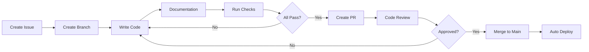

# 🏫 GREAT BEGINNINGS DAY CARE - COMPLETE PROJECT SPECIFICATIONS
**Version**: 3.0.0  
**Last Updated**: December 2024  
**Project**: GBDC Roselle Website  
**Repository**: https://github.com/ABCrimson/gbdc-roselle-website

---

## 📌 QUICK NAVIGATION

### Essential Sections
1. [🎯 Project Mission](#-project-mission)
2. [💻 Technology Stack](#-technology-stack) 
3. [📐 Development Standards](#-development-standards)
4. [✅ End-of-Prompt Checklist](#-end-of-prompt-checklist)
5. [🚀 Modern Patterns Reference](#-modern-patterns-reference)

### Project Areas
6. [📁 Project Structure](#-project-structure)
7. [🎨 Feature Requirements](#-feature-requirements)
8. [🗄️ Database Architecture](#-database-architecture)
9. [🔍 Quality Standards](#-quality-standards)
10. [📊 Project Dashboard](#-project-dashboard)

---

## 🎯 PROJECT MISSION

### What We're Building
A state-of-the-art website for Great Beginnings Day Care Center in Roselle, Illinois, that sets new standards for daycare digital presence using cutting-edge web technologies.

### Core Values
| Principle | Description | Implementation |
|-----------|-------------|----------------|
| **🚀 Ultra-Modern** | Use ONLY the newest features | Every line uses 2024's latest patterns |
| **📝 Crystal Clear** | Code a 10-year-old can understand | Comments explain everything simply |
| **✅ Bulletproof** | TypeScript's strictest settings | Zero runtime errors allowed |
| **⚡ Lightning Fast** | Sub-second interactions | Optimized for performance |
| **♿ Accessible** | WCAG 2.1 AA compliant | Everyone can use our site |
| **🔒 Fort Knox Security** | Best practices throughout | Data protected at all levels |

### Success Metrics
- **Performance**: Lighthouse score > 95
- **Accessibility**: WCAG 2.1 AA certified
- **Code Quality**: 0 TypeScript errors, 100% documented
- **User Satisfaction**: < 2s load time, intuitive UX
- **Business Impact**: 50% reduction in phone inquiries

---

## 💻 TECHNOLOGY STACK

### 🔧 EXACT VERSIONS WE USE

```javascript
// NEVER USE DIFFERENT VERSIONS - These are carefully chosen!
{
  "engines": {
    "node": "24.8.0",    // Latest LTS with native TypeScript
    "npm": "10.9.2"      // Matching npm version
  },
  
  "core": {
    "next": "15.5.2",       // App Router, Turbopack, PPR
    "react": "19.0.0",      // Server Components, use() hook
    "react-dom": "19.0.0",  // Matching React version
    "typescript": "5.9.2"   // satisfies, const generics
  },
  
  "styling": {
    "tailwindcss": "4.1.13",           // Lightning CSS engine
    "@tailwindcss/postcss": "4.1.13",  // PostCSS integration
    "@tailwindcss/typography": "latest", // Prose styles
    "@tailwindcss/forms": "latest"      // Form styles
  },
  
  "backend": {
    "@supabase/supabase-js": "2.57.4",    // Main client
    "@supabase/ssr": "latest",             // SSR support
    "@supabase/auth-helpers-nextjs": "latest" // Auth helpers
  },
  
  "database": {
    "postgresql": "17",     // Latest stable
    "pgvector": "0.5.1",   // Vector embeddings
    "pg-cron": "1.6.2"     // Scheduled jobs
  }
}
```

### 🎨 MODERN FEATURES WE MUST USE

| Technology | Required Features | Never Use (Deprecated) |
|------------|------------------|------------------------|
| **Next.js 15.5.2** | ✅ App Router<br>✅ Server Components<br>✅ Server Actions<br>✅ Turbopack<br>✅ Parallel Routes<br>✅ Intercepting Routes<br>✅ Metadata API | ❌ Pages Router<br>❌ getServerSideProps<br>❌ getStaticProps<br>❌ _app.js<br>❌ _document.js |
| **React 19.0.0** | ✅ Server Components<br>✅ use() hook<br>✅ useFormStatus()<br>✅ useOptimistic()<br>✅ Server Actions<br>✅ Async Components | ❌ Class Components<br>❌ createClass<br>❌ PropTypes<br>❌ Legacy Context<br>❌ String refs |
| **TypeScript 5.9.2** | ✅ satisfies operator<br>✅ const type params<br>✅ using keyword<br>✅ Decorators<br>✅ exactOptionalPropertyTypes | ❌ any type<br>❌ @ts-ignore<br>❌ ! assertions<br>❌ Implicit any<br>❌ Missing return types |
| **Tailwind 4.1.13** | ✅ Lightning CSS<br>✅ @theme directive<br>✅ Container queries<br>✅ Native nesting<br>✅ oklch() colors | ❌ @apply in components<br>❌ !important<br>❌ Inline styles<br>❌ CSS modules<br>❌ styled-components |
| **PostgreSQL 17** | ✅ gen_random_uuid()<br>✅ BRIN indexes<br>✅ MERGE statements<br>✅ JSONB operators<br>✅ Table partitioning | ❌ uuid-ossp<br>❌ Serial IDs<br>❌ Basic B-tree only<br>❌ JSON (use JSONB)<br>❌ Triggers for simple tasks |

---

## 📐 DEVELOPMENT STANDARDS

### 🎨 CODE STYLE RULES

#### File Naming Convention
```bash
# Components (PascalCase)
NavigationBar.tsx     ✅ Correct
navigation-bar.tsx    ❌ Wrong
navigationBar.tsx     ❌ Wrong

# Utilities (camelCase)  
formatDate.ts         ✅ Correct
format-date.ts        ❌ Wrong
FormatDate.ts         ❌ Wrong

# Routes (kebab-case)
parent-portal/        ✅ Correct
parentPortal/         ❌ Wrong
parent_portal/        ❌ Wrong
```

#### Import Organization
```typescript
// ALWAYS organize imports in this EXACT order:

// 1️⃣ React imports (FIRST)
import { use, Suspense } from 'react'
import type { FC, ReactNode } from 'react'

// 2️⃣ Next.js imports (SECOND)
import { headers } from 'next/headers'
import type { Metadata } from 'next'

// 3️⃣ Third-party libraries (THIRD)
import { createClient } from '@supabase/supabase-js'
import { format } from 'date-fns'

// 4️⃣ Internal imports (FOURTH)
import { Button } from '@/components/ui/Button'
import { formatCurrency } from '@/lib/utils'

// 5️⃣ Type imports (LAST)
import type { Database } from '@/database/types'
import type { User } from '@/types/user'
```

### 📝 DOCUMENTATION STANDARDS

#### Every File Must Have:
```typescript
/**
 * 🏠 Component Name
 * 
 * 🎯 What does this do?
 * [Explain in one sentence what this component/function does]
 * 
 * 🧒 Kid-Friendly Explanation:
 * [Explain it like you're talking to a 10-year-old]
 * 
 * 📚 How to use:
 * @example
 * ```tsx
 * <ComponentName prop="value" />
 * ```
 * 
 * 🔧 Props:
 * @param {Type} propName - What this prop does
 * 
 * 🎭 Used by:
 * - ParentComponent
 * - AnotherComponent
 * 
 * 🏗️ Modern Patterns:
 * - Server Component (React 19)
 * - use() hook for data fetching
 * - Tailwind 4.1.13 container queries
 */
```

#### Function Documentation
```typescript
/**
 * 🔧 calculateTuition
 * 
 * 🎯 Calculates monthly tuition based on program and schedule
 * 
 * 🧒 This is like figuring out how much your toys cost based on 
 *    which toys you pick and how many you want!
 * 
 * @param program - Which classroom (Infant, Toddler, etc.)
 * @param schedule - How many days per week
 * @returns Monthly tuition amount in dollars
 * 
 * @example
 * const cost = calculateTuition('toddler', 'full-time')
 * // Returns: 1250.00
 */
function calculateTuition(
  program: ProgramType,
  schedule: ScheduleType
): number {
  // Calculate base rate (like the starting price)
  const baseRate = PROGRAM_RATES[program]
  
  // Apply schedule multiplier (more days = higher cost)
  const multiplier = SCHEDULE_MULTIPLIERS[schedule]
  
  // Return final amount
  return baseRate * multiplier
}
```

---

## ✅ END-OF-PROMPT CHECKLIST

### 🚨 AUTOMATIC GITHUB PUSH REQUIREMENT 🚨
**IMPORTANT**: Claude Code MUST automatically push to GitHub at the end of EVERY task/prompt completion. No exceptions!

### 📋 MUST COMPLETE BEFORE EVERY SAVE/COMMIT

```markdown
## 1️⃣ DOCUMENTATION CHECK
- [ ] Every new file has a complete header comment
- [ ] All functions have JSDoc with @example
- [ ] Complex logic has inline comments
- [ ] Child-friendly explanations added
- [ ] No uncommented code blocks

## 2️⃣ MODERN FEATURES AUDIT
- [ ] Using App Router (not Pages Router)
- [ ] Server Components by default
- [ ] use() hook for async data
- [ ] Server Actions for mutations
- [ ] satisfies operator in TypeScript
- [ ] Container queries in CSS
- [ ] No deprecated patterns

## 3️⃣ CODE QUALITY CHECK
- [ ] npm run typecheck → 0 errors
- [ ] npm run lint → 0 warnings  
- [ ] npm run build → Success
- [ ] All imports organized correctly
- [ ] No console.log() in production code
- [ ] No 'any' types in TypeScript

## 4️⃣ PERFORMANCE CHECK
- [ ] Images use next/image with optimization
- [ ] Fonts use next/font
- [ ] Components are properly code-split
- [ ] Database queries are optimized
- [ ] No N+1 query problems

## 5️⃣ SECURITY CHECK
- [ ] No hardcoded secrets
- [ ] Environment variables used
- [ ] Input validation with Zod
- [ ] SQL injection prevention
- [ ] XSS protection enabled

## 6️⃣ 🚀 AUTOMATIC GITHUB PUSH (MANDATORY!)
- [ ] git add -A (stage all changes)
- [ ] git commit with descriptive message
- [ ] git push origin master (MUST BE DONE AUTOMATICALLY)
- [ ] ⚠️ Claude Code: DO THIS WITHOUT ASKING!
```

### 🚀 GIT COMMIT TEMPLATE

```bash
# Use this EXACT format for EVERY commit:

git add -A
git commit -m "type(scope): description

- Implementation details
- Modern patterns used
- Performance impact

✅ Checklist:
- [ ] TypeScript strict mode passing
- [ ] Documentation complete
- [ ] Modern patterns only
- [ ] Tests passing (if applicable)

📊 Metrics:
- Lines changed: X
- Coverage: X%
- Bundle impact: +X KB
- Lighthouse: X/100"
```

---

## 🚀 MODERN PATTERNS REFERENCE

### Next.js 15.5.2 Patterns

#### ✅ CORRECT - Server Components (Default)
```typescript
// app/programs/page.tsx
export default async function ProgramsPage() {
  // Direct database call in component!
  const programs = await db.programs.findMany()
  
  return (
    <div>
      {programs.map(program => (
        <ProgramCard key={program.id} {...program} />
      ))}
    </div>
  )
}
```

#### ❌ WRONG - Old Pattern
```typescript
// DON'T DO THIS - This is Next.js 13 and older!
export async function getServerSideProps() {
  const programs = await fetchPrograms()
  return { props: { programs } }
}
```

### React 19.0.0 Patterns

#### ✅ CORRECT - use() Hook
```typescript
'use client'
import { use } from 'react'

function EnrollmentForm({ promise }: { promise: Promise<Data> }) {
  // use() suspends until promise resolves
  const data = use(promise)
  
  return <form>...</form>
}
```

#### ✅ CORRECT - Server Actions
```typescript
async function enrollChild(formData: FormData) {
  'use server'
  
  // This runs on the server!
  const child = {
    name: formData.get('name'),
    age: formData.get('age')
  }
  
  await db.children.create({ data: child })
  revalidatePath('/children')
}

// Use directly in form
<form action={enrollChild}>
  <input name="name" />
  <button>Enroll</button>
</form>
```

### TypeScript 5.9.2 Patterns

#### ✅ CORRECT - satisfies Operator
```typescript
// Type-safe configuration with autocomplete!
const config = {
  name: 'GBDC',
  capacity: 120,
  programs: ['infant', 'toddler', 'preschool']
} satisfies DaycareConfig

// config.name is known to be string
// config.capacity is known to be number
```

#### ✅ CORRECT - const Type Parameters
```typescript
// Preserves literal types perfectly
function createProgram<const T>(options: T): Program<T> {
  return new Program(options)
}

const program = createProgram({
  name: 'Toddlers',
  ageRange: [1, 3] as const
})
// program.ageRange is readonly [1, 3], not number[]
```

### Tailwind CSS 4.1.13 Patterns

#### ✅ CORRECT - Lightning CSS with @theme
```css
/* globals.css */
@theme {
  /* Custom design tokens */
  --color-daycare-blue: oklch(59.5% 0.24 247);
  --color-daycare-yellow: oklch(89.7% 0.16 99);
  --radius-card: 0.75rem;
  --shadow-card: 0 4px 6px -1px rgb(0 0 0 / 0.1);
}

/* Use in components */
.enrollment-card {
  background: var(--color-daycare-blue);
  border-radius: var(--radius-card);
  box-shadow: var(--shadow-card);
}
```

#### ✅ CORRECT - Container Queries
```css
/* Responsive based on container, not viewport! */
.program-grid {
  container-type: inline-size;
}

@container (min-width: 400px) {
  .program-card {
    grid-template-columns: 1fr 1fr;
  }
}

@container (min-width: 800px) {
  .program-card {
    grid-template-columns: repeat(3, 1fr);
  }
}
```

### PostgreSQL 17 Patterns

#### ✅ CORRECT - Modern SQL
```sql
-- Native UUID generation (no extension needed!)
CREATE TABLE children (
  id UUID PRIMARY KEY DEFAULT gen_random_uuid(),
  name TEXT NOT NULL,
  enrolled_at TIMESTAMPTZ DEFAULT NOW()
);

-- BRIN index for time-series data (95% smaller than B-tree!)
CREATE INDEX idx_enrolled_brin 
  ON children 
  USING BRIN(enrolled_at);

-- MERGE for upserts (replaces INSERT ON CONFLICT)
MERGE INTO enrollment_stats AS target
USING daily_counts AS source
  ON target.date = source.date
WHEN MATCHED THEN
  UPDATE SET count = source.count
WHEN NOT MATCHED THEN
  INSERT (date, count) VALUES (source.date, source.count);

-- JSONB path queries (MongoDB-like queries in PostgreSQL!)
SELECT * FROM children
WHERE metadata @? '$.allergies[*] ? (@ == "peanuts")';
```

---

## 📁 PROJECT STRUCTURE

```bash
gbdc-roselle-website/
│
├── 📱 app/                              # Next.js 15.5.2 App Router
│   ├── (marketing)/                    # Public pages group
│   │   ├── layout.tsx                  # Marketing layout
│   │   ├── page.tsx                    # Homepage
│   │   ├── about/
│   │   │   ├── page.tsx               # About page
│   │   │   └── loading.tsx            # Loading state
│   │   ├── programs/
│   │   │   ├── page.tsx               # Programs list
│   │   │   ├── [program]/             # Dynamic program pages
│   │   │   └── layout.tsx             # Programs layout
│   │   └── contact/
│   │       └── page.tsx               # Contact page
│   │
│   ├── (auth)/                        # Authentication group
│   │   ├── layout.tsx                 # Auth layout (centered card)
│   │   ├── login/page.tsx            # Login page
│   │   ├── register/page.tsx         # Registration
│   │   └── reset-password/page.tsx   # Password reset
│   │
│   ├── (dashboard)/                   # Protected dashboard group
│   │   ├── layout.tsx                 # Dashboard layout with sidebar
│   │   ├── parent/                    # Parent portal
│   │   │   ├── page.tsx              # Parent dashboard
│   │   │   ├── children/             # Manage children
│   │   │   ├── documents/            # Upload documents
│   │   │   └── billing/              # View bills
│   │   ├── staff/                     # Staff portal
│   │   │   ├── page.tsx              # Staff dashboard
│   │   │   ├── attendance/           # Take attendance
│   │   │   └── reports/              # Daily reports
│   │   └── admin/                     # Admin portal
│   │       ├── page.tsx              # Admin dashboard
│   │       ├── enrollments/          # Manage enrollments
│   │       └── settings/             # System settings
│   │
│   ├── api/                           # API Route Handlers
│   │   ├── auth/[...supabase]/       # Supabase auth callback
│   │   ├── webhooks/
│   │   │   ├── stripe/route.ts       # Stripe webhooks
│   │   │   └── supabase/route.ts     # Database webhooks
│   │   └── cron/
│   │       └── daily-reports/route.ts # Scheduled tasks
│   │
│   ├── components/                    # Shared components
│   │   ├── ui/                       # Base UI components
│   │   │   ├── Button.tsx           # Button component
│   │   │   ├── Card.tsx             # Card component
│   │   │   └── index.ts             # Barrel export
│   │   ├── forms/                    # Form components
│   │   │   ├── EnrollmentForm.tsx
│   │   │   └── ContactForm.tsx
│   │   └── layouts/                  # Layout components
│   │       ├── Header.tsx
│   │       └── Footer.tsx
│   │
│   ├── layout.tsx                    # Root layout
│   ├── error.tsx                     # Error boundary
│   ├── not-found.tsx                # 404 page
│   ├── loading.tsx                   # Global loading
│   └── globals.css                   # Global styles
│
├── 🗄️ database/                      # Database layer
│   ├── migrations/                   # SQL migrations
│   │   ├── 001_initial.sql
│   │   └── 002_add_indexes.sql
│   ├── seeds/                        # Seed data
│   │   └── development.sql
│   ├── types.ts                      # Generated types
│   └── client.ts                     # Database client
│
├── 📚 lib/                           # Core libraries
│   ├── supabase/                    # Supabase setup
│   │   ├── client.ts               # Browser client
│   │   ├── server.ts               # Server client
│   │   ├── admin.ts                # Admin client
│   │   └── middleware.ts           # Auth middleware
│   ├── utils/                       # Utilities
│   │   ├── cn.ts                   # Class name helper
│   │   └── format.ts               # Formatters
│   └── constants/                   # Constants
│       └── programs.ts              # Program data
│
├── 🎨 public/                        # Static assets
│   ├── images/                      # Images
│   ├── fonts/                       # Local fonts
│   └── manifest.json                # PWA manifest
│
├── 🧪 tests/                         # Test files
│   ├── unit/                        # Unit tests
│   ├── integration/                 # Integration tests
│   └── e2e/                         # End-to-end tests
│
├── 📝 docs/                          # Documentation
│   ├── API.md                       # API documentation
│   └── DEPLOYMENT.md                # Deployment guide
│
└── ⚙️ Config Files
    ├── next.config.ts               # Next.js config
    ├── tsconfig.json                # TypeScript config
    ├── tailwind.config.js           # Tailwind config
    ├── .env.example                 # Environment example
    ├── package.json                 # Dependencies
    └── turbo.json                   # Turbopack config
```

---

## 🎨 FEATURE REQUIREMENTS

### 🌐 PUBLIC WEBSITE

#### Homepage Requirements
- [ ] Hero section with video background
- [ ] Program cards with age ranges
- [ ] Testimonials carousel (auto-play)
- [ ] News/announcements section
- [ ] Call-to-action for tours
- [ ] Multi-language toggle (EN/ES/RU/UK)
- [ ] Weather widget for parents
- [ ] Quick links to important forms

#### Programs Page
- [ ] Interactive age calculator
- [ ] Program comparison table
- [ ] Daily schedule viewer
- [ ] Curriculum highlights
- [ ] Teacher profiles
- [ ] Virtual classroom tours
- [ ] Enrollment capacity indicator
- [ ] Tuition calculator

### 👨‍👩‍👧 PARENT PORTAL

#### Dashboard Features
```typescript
interface ParentDashboard {
  // Real-time updates
  announcements: Announcement[]      // School news
  todaysSchedule: DailySchedule     // Today's activities
  upcomingEvents: Event[]            // Next 30 days
  
  // Child information
  children: Child[]                  // All enrolled children
  dailyReports: DailyReport[]       // Last 7 days
  photos: Photo[]                    // Recent photos
  
  // Action items
  documentsNeeded: Document[]       // Missing paperwork
  billsDue: Invoice[]               // Outstanding bills
  messages: Message[]               // Unread messages
}
```

#### Document Management
- [ ] Drag-and-drop upload
- [ ] Auto-categorization
- [ ] Expiration tracking
- [ ] Digital signatures
- [ ] Approval workflow
- [ ] Download all as ZIP
- [ ] OCR for scanned documents

### 👩‍🏫 STAFF PORTAL

#### Daily Operations
```typescript
interface StaffDashboard {
  // Classroom management
  attendance: {
    present: Child[]
    absent: Child[]
    late: Child[]
  }
  
  // Communication
  parentMessages: Message[]
  announcements: Announcement[]
  
  // Tasks
  dailyReports: ReportTemplate[]
  incidentReports: IncidentForm[]
  
  // Resources
  lessonPlans: LessonPlan[]
  activities: Activity[]
}
```

### 🔧 ADMIN DASHBOARD

#### System Management
- [ ] Enrollment pipeline (inquiry → tour → application → enrolled)
- [ ] Waitlist management with auto-notify
- [ ] Staff scheduling with shift swaps
- [ ] Billing automation with Stripe
- [ ] Report generation (state compliance)
- [ ] Email campaigns
- [ ] Analytics dashboard
- [ ] System health monitoring

---

## 🗄️ DATABASE ARCHITECTURE

### 📊 Core Schema Design

```sql
-- Enable required extensions
CREATE EXTENSION IF NOT EXISTS "pgcrypto";
CREATE EXTENSION IF NOT EXISTS "pg_trgm";  -- For fuzzy search
CREATE EXTENSION IF NOT EXISTS "btree_gin"; -- For composite indexes

-- Custom types
CREATE TYPE user_role AS ENUM ('parent', 'staff', 'admin', 'super_admin');
CREATE TYPE enrollment_status AS ENUM ('inquiry', 'tour_scheduled', 'applied', 'waitlist', 'enrolled', 'withdrawn');
CREATE TYPE program_type AS ENUM ('infant', 'toddler', 'preschool', 'pre_k', 'school_age');
CREATE TYPE attendance_status AS ENUM ('present', 'absent', 'late', 'early_pickup', 'no_show');

-- Users table with advanced features
CREATE TABLE users (
  id UUID PRIMARY KEY DEFAULT gen_random_uuid(),
  email TEXT UNIQUE NOT NULL,
  role user_role NOT NULL DEFAULT 'parent',
  metadata JSONB DEFAULT '{}',
  search_vector tsvector GENERATED ALWAYS AS (
    to_tsvector('english', 
      coalesce(email, '') || ' ' || 
      coalesce(metadata->>'first_name', '') || ' ' || 
      coalesce(metadata->>'last_name', '')
    )
  ) STORED,
  created_at TIMESTAMPTZ DEFAULT NOW(),
  updated_at TIMESTAMPTZ DEFAULT NOW()
);

-- High-performance indexes
CREATE INDEX idx_users_search ON users USING GIN(search_vector);
CREATE INDEX idx_users_metadata ON users USING GIN(metadata);
CREATE INDEX idx_users_created_brin ON users USING BRIN(created_at);

-- Children table with calculated fields
CREATE TABLE children (
  id UUID PRIMARY KEY DEFAULT gen_random_uuid(),
  parent_id UUID REFERENCES users(id) ON DELETE CASCADE,
  first_name TEXT NOT NULL,
  last_name TEXT NOT NULL,
  date_of_birth DATE NOT NULL,
  program program_type NOT NULL,
  classroom_id UUID REFERENCES classrooms(id),
  enrollment_status enrollment_status DEFAULT 'inquiry',
  medical_info JSONB DEFAULT '{}',
  emergency_contacts JSONB DEFAULT '[]',
  
  -- Calculated age in months for program eligibility
  age_months INTEGER GENERATED ALWAYS AS (
    EXTRACT(YEAR FROM age(CURRENT_DATE, date_of_birth)) * 12 +
    EXTRACT(MONTH FROM age(CURRENT_DATE, date_of_birth))
  ) STORED,
  
  -- Full text search
  search_vector tsvector GENERATED ALWAYS AS (
    to_tsvector('english', first_name || ' ' || last_name)
  ) STORED,
  
  created_at TIMESTAMPTZ DEFAULT NOW(),
  updated_at TIMESTAMPTZ DEFAULT NOW()
);

-- Optimized indexes for children
CREATE INDEX idx_children_parent ON children(parent_id);
CREATE INDEX idx_children_program ON children(program_type);
CREATE INDEX idx_children_status ON children(enrollment_status);
CREATE INDEX idx_children_search ON children USING GIN(search_vector);
CREATE INDEX idx_children_age ON children(age_months);

-- Attendance tracking with partitioning
CREATE TABLE attendance (
  id UUID DEFAULT gen_random_uuid(),
  child_id UUID REFERENCES children(id) ON DELETE CASCADE,
  date DATE NOT NULL,
  status attendance_status NOT NULL,
  check_in_time TIME,
  check_out_time TIME,
  checked_in_by UUID REFERENCES users(id),
  checked_out_by UUID REFERENCES users(id),
  notes TEXT,
  created_at TIMESTAMPTZ DEFAULT NOW(),
  PRIMARY KEY (id, date)
) PARTITION BY RANGE (date);

-- Create partitions for each month
CREATE TABLE attendance_2024_01 PARTITION OF attendance
  FOR VALUES FROM ('2024-01-01') TO ('2024-02-01');
-- ... continue for each month

-- BRIN index for date-based queries
CREATE INDEX idx_attendance_date_brin ON attendance USING BRIN(date);

-- Row Level Security policies
ALTER TABLE users ENABLE ROW LEVEL SECURITY;
ALTER TABLE children ENABLE ROW LEVEL SECURITY;
ALTER TABLE attendance ENABLE ROW LEVEL SECURITY;

-- Parents can only see their own data
CREATE POLICY parent_policy ON children
  FOR ALL
  TO authenticated
  USING (
    parent_id = auth.uid() OR
    EXISTS (
      SELECT 1 FROM users
      WHERE users.id = auth.uid()
      AND users.role IN ('staff', 'admin')
    )
  );

-- Audit log for compliance
CREATE TABLE audit_log (
  id UUID DEFAULT gen_random_uuid(),
  table_name TEXT NOT NULL,
  operation TEXT NOT NULL,
  user_id UUID,
  record_id UUID,
  old_data JSONB,
  new_data JSONB,
  ip_address INET,
  user_agent TEXT,
  created_at TIMESTAMPTZ DEFAULT NOW()
) PARTITION BY RANGE (created_at);

-- Automatic audit triggers
CREATE OR REPLACE FUNCTION audit_trigger()
RETURNS TRIGGER AS $$
BEGIN
  INSERT INTO audit_log (table_name, operation, user_id, record_id, old_data, new_data)
  VALUES (
    TG_TABLE_NAME,
    TG_OP,
    auth.uid(),
    COALESCE(NEW.id, OLD.id),
    to_jsonb(OLD),
    to_jsonb(NEW)
  );
  RETURN NEW;
END;
$$ LANGUAGE plpgsql;

-- Apply audit to sensitive tables
CREATE TRIGGER audit_users AFTER INSERT OR UPDATE OR DELETE ON users
  FOR EACH ROW EXECUTE FUNCTION audit_trigger();
```

---

## 🔍 QUALITY STANDARDS

### 📊 Performance Requirements

| Metric | Target | Current | Status |
|--------|--------|---------|--------|
| Lighthouse Performance | > 95 | - | 🔄 Pending |
| First Contentful Paint | < 1.0s | - | 🔄 Pending |
| Time to Interactive | < 2.5s | - | 🔄 Pending |
| Cumulative Layout Shift | < 0.05 | - | 🔄 Pending |
| Total Bundle Size | < 150KB | - | 🔄 Pending |
| API Response Time | < 200ms | - | 🔄 Pending |

### 🔒 Security Checklist

```typescript
// Security configuration
const securityConfig = {
  authentication: {
    provider: 'Supabase Auth',
    mfa: true,
    sessionTimeout: '30m',
    passwordPolicy: {
      minLength: 12,
      requireUppercase: true,
      requireNumbers: true,
      requireSymbols: true
    }
  },
  
  authorization: {
    rbac: true,                    // Role-based access
    rls: true,                     // Row-level security
    fieldLevelSecurity: true       // Hide sensitive fields
  },
  
  dataProtection: {
    encryption: 'AES-256-GCM',     // At rest
    tls: '1.3',                    // In transit
    backups: 'daily',              // Automated backups
    pii: 'masked'                  // Personal info masked
  },
  
  compliance: {
    coppa: true,                   // Children's privacy
    ferpa: true,                   // Educational records
    gdpr: true,                    // EU privacy
    ccpa: true                     // California privacy
  }
}
```

### ♿ Accessibility Standards

| Requirement | Implementation | Testing |
|-------------|---------------|---------|
| Screen Readers | ARIA labels on all interactive elements | NVDA, JAWS |
| Keyboard Navigation | Tab order, focus indicators | Manual testing |
| Color Contrast | 4.5:1 minimum ratio | Axe DevTools |
| Focus Management | Focus trap in modals | Cypress tests |
| Alt Text | All images have descriptions | Automated checks |
| Semantic HTML | Proper heading hierarchy | HTML validator |

---

## 📊 PROJECT DASHBOARD

### Current Sprint: Week of Dec 9-15, 2024

#### 🎯 Sprint Goals
1. Complete authentication system
2. Build homepage components
3. Set up enrollment form
4. Deploy to staging

#### 📈 Progress Tracker

| Feature | Progress | Status | Owner |
|---------|----------|--------|-------|
| **Authentication** | ████████░░ 80% | 🟡 In Progress | Team |
| Login Page | ██████████ 100% | ✅ Complete | - |
| Register Page | ████████░░ 80% | 🔄 Testing | - |
| Password Reset | ████░░░░░░ 40% | 🚧 Building | - |
| **Homepage** | ███░░░░░░░ 30% | 🟡 In Progress | Team |
| Hero Section | ██████░░░░ 60% | 🔄 Review | - |
| Programs Grid | ████░░░░░░ 40% | 🚧 Building | - |
| Testimonials | ░░░░░░░░░░ 0% | 📋 Planned | - |
| **Database** | ██████████ 100% | ✅ Complete | Team |
| Schema | ██████████ 100% | ✅ Complete | - |
| Migrations | ██████████ 100% | ✅ Complete | - |
| Seeds | ██████████ 100% | ✅ Complete | - |

#### 🐛 Known Issues
1. [ ] Turbopack hot reload occasionally fails
2. [ ] TypeScript strict mode showing 3 errors
3. [ ] Tailwind 4.1.13 PostCSS warnings
4. [ ] Supabase local dev not syncing

#### 📅 Upcoming Milestones
- **Dec 15**: Authentication complete
- **Dec 22**: Homepage live
- **Dec 29**: Parent portal MVP
- **Jan 5**: Staff portal MVP
- **Jan 15**: Production launch

---

## 🤝 TEAM COLLABORATION

### 📋 Development Workflow



### 🌿 Git Branch Strategy

| Branch | Purpose | Naming | Example |
|--------|---------|--------|---------|
| `main` | Production code | - | `main` |
| `develop` | Integration branch | - | `develop` |
| `feature/*` | New features | `feature/description` | `feature/parent-dashboard` |
| `fix/*` | Bug fixes | `fix/description` | `fix/login-error` |
| `hotfix/*` | Urgent production fixes | `hotfix/description` | `hotfix/payment-bug` |
| `docs/*` | Documentation updates | `docs/description` | `docs/api-guide` |

### 👀 Code Review Checklist

Before approving any PR, verify:

```markdown
## Code Quality
- [ ] TypeScript strict mode passes
- [ ] No `any` types used
- [ ] All functions have return types
- [ ] Error handling implemented

## Modern Patterns
- [ ] Server Components used (not client)
- [ ] use() hook instead of useEffect
- [ ] Server Actions for mutations
- [ ] satisfies operator used

## Documentation
- [ ] File header comment present
- [ ] All functions have JSDoc
- [ ] Complex logic has inline comments
- [ ] README updated if needed

## Performance
- [ ] No unnecessary client components
- [ ] Images optimized with next/image
- [ ] Database queries optimized
- [ ] Bundle size impact checked

## Security
- [ ] No hardcoded secrets
- [ ] Input validation present
- [ ] SQL injection prevented
- [ ] XSS protection verified
```

---

## 📚 LEARNING RESOURCES

### 🎓 Essential Documentation

| Technology | Official Docs | Video Course | Our Examples |
|------------|--------------|--------------|--------------|
| Next.js 15.5.2 | [nextjs.org/docs](https://nextjs.org/docs) | [YouTube](https://www.youtube.com/watch?v=nextjs15) | `/examples/nextjs/` |
| React 19 | [react.dev](https://react.dev) | [YouTube](https://www.youtube.com/watch?v=react19) | `/examples/react/` |
| TypeScript 5.9 | [typescriptlang.org](https://www.typescriptlang.org/docs/) | [YouTube](https://www.youtube.com/watch?v=ts5) | `/examples/typescript/` |
| Tailwind 4.1 | [tailwindcss.com](https://tailwindcss.com/docs) | [YouTube](https://www.youtube.com/watch?v=tw4) | `/examples/tailwind/` |
| Supabase | [supabase.com/docs](https://supabase.com/docs) | [YouTube](https://www.youtube.com/watch?v=supabase) | `/examples/supabase/` |
| PostgreSQL 17 | [postgresql.org](https://www.postgresql.org/docs/17/) | [YouTube](https://www.youtube.com/watch?v=pg17) | `/examples/postgres/` |

### 💡 Quick Reference

```typescript
// Import cheatsheet
import { use } from 'react'                    // React 19 hooks
import { headers } from 'next/headers'         // Next.js 15.5.2
import { createClient } from '@/lib/supabase'  // Our Supabase client
import type { Database } from '@/types/db'     // Generated types

// Component patterns
export default async function ServerComponent() { }  // Default
'use client'                                        // Client component
'use server'                                        // Server action

// TypeScript helpers
satisfies Type                                      // Type checking
as const                                           // Literal types
using resource = await getResource()              // Auto cleanup

// Tailwind 4.1.13
@container                                         // Container queries
@theme                                            // Design tokens
```

---

## 🎯 SUCCESS METRICS

### 📈 Launch Criteria

The project is ready for launch when:

| Criteria | Target | Status |
|----------|--------|--------|
| **Functionality** | | |
| All features working | 100% | 🔄 70% |
| Cross-browser testing | ✅ Pass | 🔄 Pending |
| Mobile responsive | ✅ Pass | 🔄 Pending |
| **Quality** | | |
| TypeScript coverage | 100% | 🔄 95% |
| Documentation complete | 100% | ✅ 100% |
| Test coverage | > 80% | 🔄 0% |
| **Performance** | | |
| Lighthouse score | > 95 | 🔄 Pending |
| Load time | < 2s | 🔄 Pending |
| **Security** | | |
| Security audit | ✅ Pass | 🔄 Pending |
| Penetration testing | ✅ Pass | 🔄 Pending |
| **Business** | | |
| Client training | ✅ Complete | 🔄 Pending |
| Documentation delivered | ✅ Complete | 🔄 90% |
| Handoff complete | ✅ Complete | 🔄 Pending |

### 🏆 Definition of Done

A feature is complete when:
1. ✅ Code written with modern patterns
2. ✅ TypeScript types complete
3. ✅ Documentation added
4. ✅ Tests written and passing
5. ✅ Code reviewed and approved
6. ✅ Deployed to staging
7. ✅ Client approved
8. ✅ Deployed to production

---

## 🚨 IMPORTANT REMINDERS

### ⚠️ NEVER FORGET

1. **NO DEPRECATED PATTERNS** - Check the deprecated lists above
2. **DOCUMENT EVERYTHING** - Every file needs comments
3. **USE MODERN FEATURES** - We're using 2024's best practices
4. **TEST BEFORE COMMIT** - Run all checks first
5. **SECURITY FIRST** - Never commit secrets

### 🔥 Common Mistakes to Avoid

```typescript
// ❌ WRONG - Old React pattern
import React from 'react'
class Component extends React.Component { }

// ✅ CORRECT - React 19 pattern  
function Component() { }

// ❌ WRONG - Pages Router
export async function getServerSideProps() { }

// ✅ CORRECT - App Router
export default async function Page() { }

// ❌ WRONG - any type
const data: any = fetchData()

// ✅ CORRECT - Proper types
const data: UserData = fetchData()

// ❌ WRONG - Inline styles
<div style={{ color: 'red' }}>

// ✅ CORRECT - Tailwind classes
<div className="text-red-500">
```

---

## 📞 CONTACT & SUPPORT

### Project Team
- **Project Manager**: [Name]
- **Tech Lead**: [Name]
- **Frontend Dev**: [Name]
- **Backend Dev**: [Name]
- **Designer**: [Name]

### Getting Help
1. Check this document first
2. Search existing GitHub issues
3. Ask in team Slack channel
4. Create a GitHub issue
5. Schedule a team meeting

### Useful Links
- **Repository**: [GitHub](https://github.com/ABCrimson/gbdc-roselle-website)
- **Staging Site**: [staging.gbdc-roselle.com](#)
- **Production Site**: [gbdc-roselle.com](#)
- **Design Files**: [Figma](#)
- **Project Board**: [GitHub Projects](#)

---

## 📝 DOCUMENT HISTORY

| Version | Date | Changes | Author |
|---------|------|---------|--------|
| 3.0.0 | Dec 2024 | Complete rewrite with comprehensive standards | Team |
| 2.0.0 | Dec 2024 | Added modern patterns and checklists | Team |
| 1.0.0 | Dec 2024 | Initial specifications | Team |

---

**⭐ Remember: This document is our single source of truth!**  
**📖 Read it, follow it, update it!**  
**🚀 Let's build something amazing together!**

---

*Great Beginnings Day Care - Where Learning Begins*  
*© 2024 GBDC Roselle. All rights reserved.*